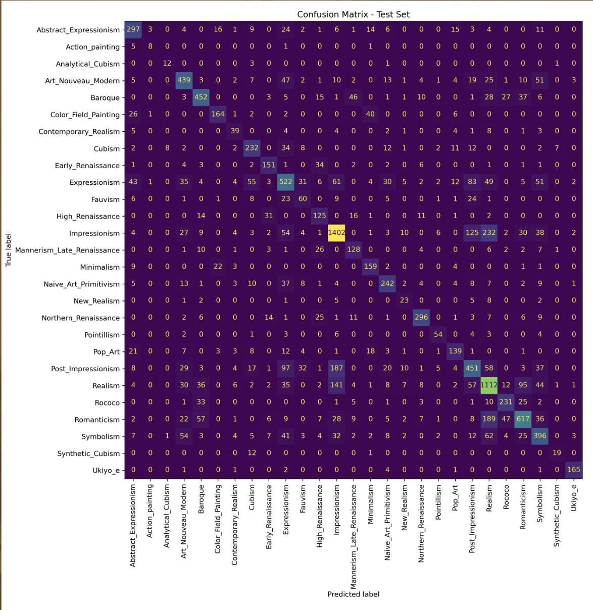

# WikiArt Style Classification

Deep Learning project for artistic style classification using transfer learning with ResNet50 and PyTorch.

The objective of this project was not only to obtain good classification performance, but also to understand how different training strategies affect the behaviour of the model through a sequence of controlled experiments.

<p align="center">
  
</p>

---

## Overview

The model classifies paintings into one of **27 artistic styles** from the WikiArt dataset.

Instead of performing an extensive hyperparameter search, the project follows an experimental approach where each modification is motivated by the results of previous experiments. This allows understanding why certain techniques improve (or worsen) the final performance.

The project explores topics such as:

- Transfer Learning
- Fine-tuning strategies
- Class imbalance handling
- Data augmentation
- Image resolution
- Duplicate detection
- Out-of-Distribution (OOD) evaluation

---

## Dataset

- **Dataset:** WikiArt
- **Images:** ~81,000
- **Classes:** 27 artistic styles

The dataset is highly imbalanced, with some artistic styles containing thousands of paintings while others contain only a few hundred. Several techniques were evaluated to reduce the impact of this imbalance during training.

An additional **external OOD dataset** was also created manually using paintings collected outside WikiArt in order to evaluate how well the model generalizes to unseen data.

---

## Model

The final model is based on a pretrained **ResNet50**.

Training pipeline:

```
Image
   │
Resize / Padding / Crop
   │
Data Augmentation
   │
Normalization
   │
ResNet50
   │
Global Average Pooling
   │
Fully Connected Layer
   │
27 Style Predictions
```

The model is trained using **CrossEntropyLoss**, together with label smoothing and soft class weights.

---

## Experiments

The project was organised as a sequence of experiments rather than isolated changes.

Some of the most relevant experiments include:

- Baseline with ResNet18
- Feature extraction vs. fine-tuning
- Partial backbone unfreezing
- Different strategies for handling class imbalance
- Data augmentation
- Higher input resolution
- Duplicate image detection
- Out-of-Distribution (OOD) evaluation using an external dataset
- Grouping visually similar artistic styles

---

## Results

The best model achieved approximately:

| Metric | Value |
|---------|------:|
| Accuracy | ~0.69 |
| Macro F1 | ~0.69 |

The external OOD evaluation obtained similar performance, showing that the model was able to generalize reasonably well to paintings outside the original WikiArt dataset.

---

## Repository Structure

```
models/
scripts/
utils/
data/
train.py
test.py
main.py
```

---

## Technologies

- Python
- PyTorch
- Torchvision
- NumPy
- Pandas
- Weights & Biases

---

## Future Work

Possible future improvements include:

- Vision Transformers (ViT)
- Grad-CAM visualizations
- Larger OOD datasets
- Self-supervised pretraining

---

## Author

Martí Gasol Cos

Data Engineering Student · Universitat Autònoma de Barcelona